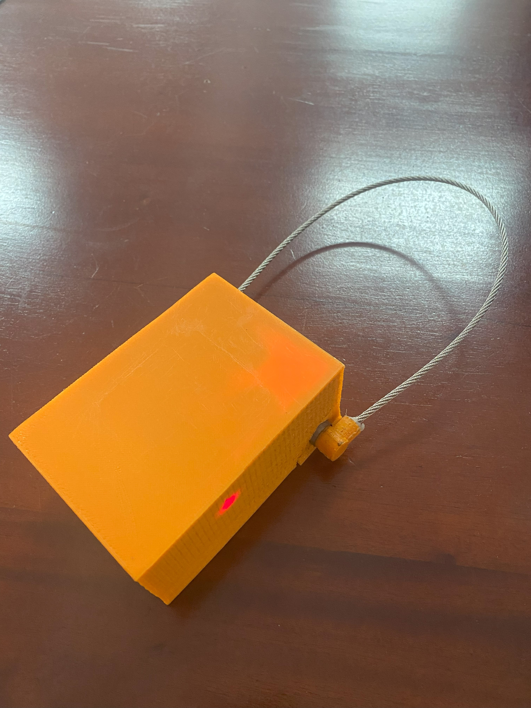

# Smart-Tracking-Seal

## Overview
The **Smart Tracking Seal** is an innovative electronic device designed to enhance the efficiency and security of goods transportation in containers. Its physical design incorporates a wire that acts as the seal, offering the benefits of reusability. This device can be easily attached to containers, providing information about the contents and ensuring the integrity of the shipment throughout the journey. With the "CargoGaurad" mobile APP, users can track the real-time location and status of the lock.

The **"CargoGauard"** app was developed using Android Studio. **Firebase Realtime Database** was used to store data, and **Firebase Authentication** was used for user authentication.

Physical View of the Device

CargoGuard App Screenshots

## Features
- **Real-time Location Tracking :** Disconnected place detection
- **Mobile Application Integration :** Customized App
- **Lock State Verification :** SMS notification & App Notification
- **Manage Truck Information:** Track and update truck details remotely

## User Benefits
- **Easy Data Handle**
  - Truck information, driver details, and item specifics can be easily managed and viewed using the cloud database.
  - Track multiple locks using the mobile app.
   
- **Security and Privacy**
  - Secure Cloud Storage
  - Regular Security Audits
  - Immediate Alerts
  - Protecting Sensitive Information
   
- **Long Battery Life**
  - The device is equipped with three lithium-ion batteries, providing a total capacity of 9600 mAh.
   
- **Support and Maintenance**
  - 24/7 Technical support.
  - Mobile APP update, continuous improvement and bug fixes.
   
    
## Components Used

- Atmega328P Microcontroller
- A9G module
- Li-ion Battery BMS Charger Protection Board 3.7V 10A 3S

 

> [!NOTE]
> All operational information for the device is detailed in the **User Manual** PDF documents.
